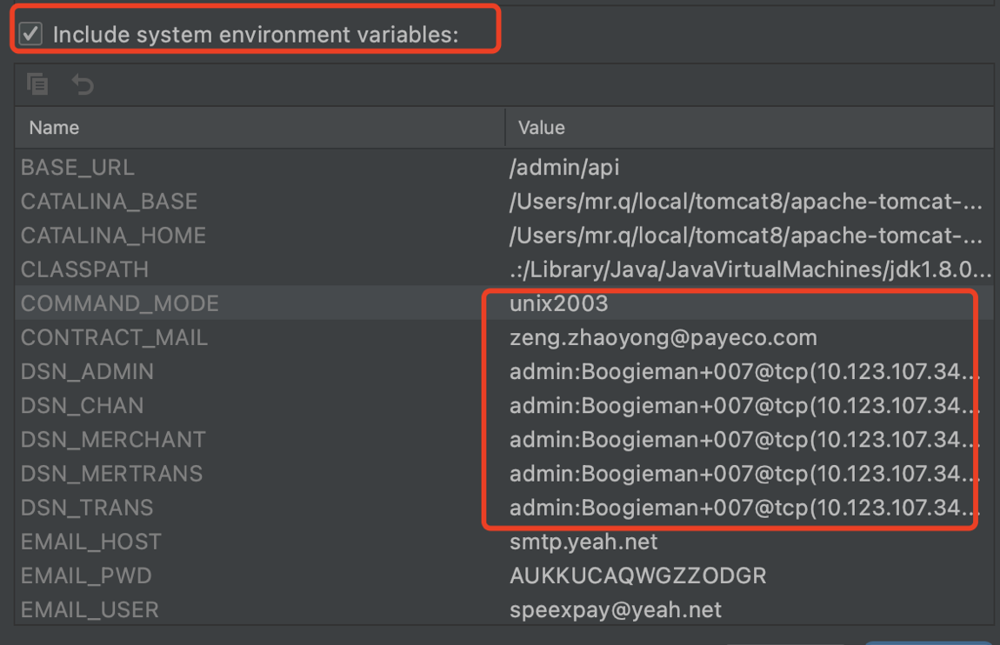

由于工作需要，开始接触Golang编程，之前一直从事的是Java开发，虽然有接触过C语言的开发，
但是Go还是完全新手的状态。
<!-- MarkdownTOC -->

- [Go语言背景](#go语言背景)
    - [Go语言特点](#Go语言特点)
    - [适用场景](#适用场景)
    - [开发工具](#开发工具)
- [开发环境搭建mac](#开发环境搭建mac)
- [开发工具破解](#开发工具破解)
- [项目编译](#项目编译)
  - [环境变量配置](#环境变量配置)
- [镜像管理](#镜像管理)
- [jenkins部署](#jenkins部署)

<!-- /MarkdownTOC -->

# Go语言背景
## Go语言特点
Go语言有时候被描述为“C 类似语言”，或者是“21 世纪的C语言”。Go 从C语言继承了相似的表达式语法、控制流结构、基础数据类型、调用参数传值、指针等很多思想，还有C语言一直所看中的编译后机器码的运行效率以及和现有操作系统的无缝适配。

因为Go语言没有类和继承的概念，所以它和 Java 或 C++ 看起来并不相同。但是它通过接口（interface）的概念来实现多态性。Go语言有一个清晰易懂的轻量级类型系统，在类型之间也没有层级之说。因此可以说Go语言是一门混合型的语言。
此外，很多重要的开源项目都是使用Go语言开发的，其中包括 Docker、Go-Ethereum、Thrraform 和 Kubernetes。
## 适用场景
Go语言是编程语言设计的又一次尝试，是对类C语言的重大改进，它不但能让你访问底层操作系统，还提供了强大的网络编程和并发编程支持。Go语言的用途众多，可以进行网络编程、系统编程、并发编程、分布式编程。

Go语言的推出，旨在不损失应用程序性能的情况下降低代码的复杂性，具有“部署简单、并发性好、语言设计良好、执行性能好”等优势，目前国内诸多 IT 公司均已采用Go语言开发项目
## 开发工具
- **VsCode：** 微软推出的一款轻量化工具，比较简单，集成度不高，需要自己安装go的扩展支持，需要安装多个插件，新手上手起来会比较吃力
  
- **Goland：** Jetbrains全家桶 专门为go语言编程而打造的一款集成IDE，打开即用，自动加载系统环境变量，非常容易上手，缺点是需要购买
可以自己去破解，这样一劳永逸。后文讲解破解步骤。


# 开发环境搭建mac
下载golang ：地址：
https://go.dev/dl/
或者
```
brew install go
```
查看版本
```
➜  ~ go version
go version go1.17.8 darwin/amd64
➜  ~ 
➜  ~ 
```

配置golang 环境变量： go env -w valiables="xxx"

或者环境变量配置：vim ~/.bash_profile
```
export GO111MODULE=on
export GOPROXY=https://goproxy.cn,direct
export GOSUMDB=off
....
```

查看go环境配置指令：
```
go env
```
当前配置：
```
GO111MODULE="on"
GOARCH="amd64"
GOBIN=""
GOCACHE="/Users/mr.q/Library/Caches/go-build"
GOENV="/Users/mr.q/Library/Application Support/go/env"
GOEXE=""
GOEXPERIMENT=""
GOFLAGS=""
GOHOSTARCH="amd64"
GOHOSTOS="darwin"
GOINSECURE=""
GOMODCACHE="/Users/mr.q/go/pkg/mod"
GONOPROXY=""
GONOSUMDB=""
GOOS="darwin"
GOPATH="/Users/mr.q/go"
GOPRIVATE=""
GOPROXY="https://goproxy.cn,direct"
GOROOT="/usr/local/go"
GOSUMDB="off"
GOTMPDIR=""
GOTOOLDIR="/usr/local/go/pkg/tool/darwin_amd64"
GOVCS=""
GOVERSION="go1.17.8"
GCCGO="gccgo"
AR="ar"
CC="clang"
CXX="clang++"
CGO_ENABLED="1"
GOMOD="/dev/null"
CGO_CFLAGS="-g -O2"
CGO_CPPFLAGS=""
CGO_CXXFLAGS="-g -O2"
CGO_FFLAGS="-g -O2"
CGO_LDFLAGS="-g -O2"
PKG_CONFIG="pkg-config"
GOGCCFLAGS="-fPIC -arch x86_64 -m64 -pthread -fno-caret-diagnostics -Qunused-arguments -fmessage-length=0 -fdebug-prefix-map=/var/folders/1l/bw6_mxmd27q3f4whnsl6pt0w0000gn/T/go-build485793739=/tmp/go-build -gno-record-gcc-switches -fno-common"
```
>注意：有些会在安装时自动配置的 这里重点关注：
`GO111MODULE="on"`,`GOPROXY="https://goproxy.cn,direct"`,`GOSUMDB="off"`
> 这三项配置


# 开发工具破解

# 项目编译
### 环境变量配置
为了项目调试方便，直接在mac系统的环境配置如下配置,打开`terminal`执行如下命令：
```
vim ~/.bash_profile
```
按 `i` 进入编辑模式，新增以下配置项，配置参数，视自己的项目参数而定
```
## upgs local  variables for test

export DSN_CHAN="admin:Boogieman+007@tcp(10.123.107.34:3306)/channel?charset=utf8&parseTime=True&loc=Asia%2FShanghai"

export DSN_MERCHANT="admin:Boogieman+007@tcp(10.123.107.34:3306)/merchant?charset=utf8&parseTime=True&loc=Asia%2FShanghai"
export DSN_ADMIN="admin:Boogieman+007@tcp(10.123.107.34:3306)/admin?charset=utf8&parseTime=True&loc=Asia%2FShanghai"
export DSN_MERTRANS="admin:Boogieman+007@tcp(10.123.107.34:3306)/mer_transaction?charset=utf8&parseTime=True&loc=Asia%2FShanghai"
export DSN_TRANS="admin:Boogieman+007@tcp(10.123.107.34:3306)/transaction?charset=utf8&parseTime=True&loc=Asia%2FShanghai"

export ROOT_PATH="/Users/mr.q/workspace/upgs/merchant-portal"
export OCR_APPCODE="aac34c24d90d4440a26590ebbc77d365"
export TYC_TOKEN="ebdab99f-7d90-42b3-ad4a-a4e97fd91304"
export MER_SERVICE_HOST="localhost:9887"
export IMAGE_PATH="/Users/mr.q/workspace/upgs/tmp"
export LEDGER_API_HOST="localhost:9888"
export MER_TRANS_API_HOST="localhost:8091"
export UPG_API_HOST="localhost:9001"
export UPG_API_TOKEN="57b0a82b9e5c922229f2ad15b78fcc56543c64eb8c23fb24"

export REGISTRY_HOST="localhost:9002"
export MESSENGER_HOST="localhost:9004"

export REDIS_URL="redis://10.123.107.110:6379"
export SECRET_KEY="fCGOLPc9k1b60yxw6EcbaIAtcC72ORvW"
export CONTRACT_MAIL="zeng.zhaoyong@payeco.com"
export EMAIL_USER="speexpay@yeah.net"
export EMAIL_PWD="AUKKUCAQWGZZODGR"
export EMAIL_HOST="smtp.yeah.net"
export JWT_PASSWORD="1c2474ad233c989e"

#export REGISTRY_HOST="10.123.107.34:9002"
#export MESSENGER_HOST="10.123.107.34:9004"
#export REDIS_URL="redis://10.123.107.34:6379"
#export SECRET_KEY="fCGOLPc9k1b60yxw6EcbaIAtcC72ORvW"
export JWT_PASSWORD="1c2474ad233c989e"
export HTTP_PORT=8000
export BASE_URL=/admin/api

## env end for upgs
```
按`esc` -> `:wq` -> 后保存配置,执行如下命令刷新环境变量：
```
source ~/.bash_profile
```
在Goland 环境变量配置菜单，可以看到如下配置，说明已经配置生效了。



# 镜像管理

# jenkins部署


